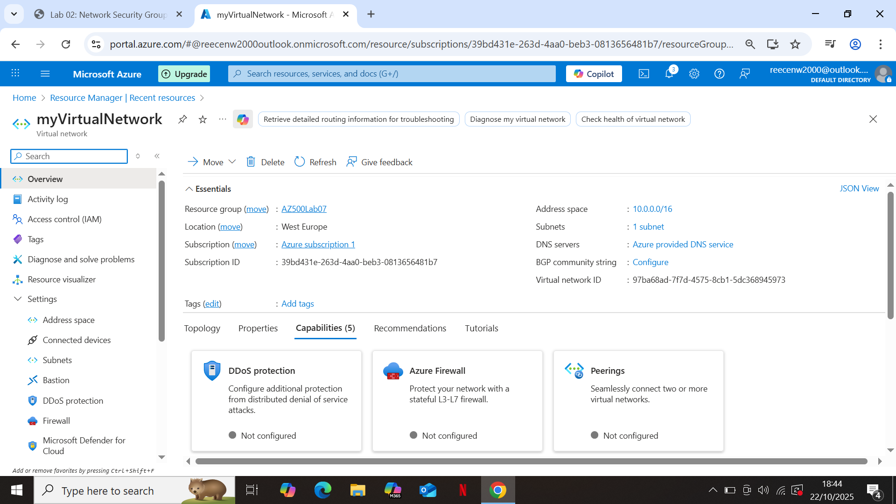

# Lab 02: Network Security Groups (NSGs) and Application Security Groups (ASGs)

## Overview
This lab focuses on implementing **Network Security Groups (NSGs)** and **Application Security Groups (ASGs)** in Azure to control inbound and outbound traffic to virtual machines and subnets.  
NSGs act as virtual firewalls that allow or deny traffic based on defined security rules, whilst ASGs allow the grouping of VMs for a greater scope to facilitate network management.
All resources were deployed in the **West Europe** region.

---

## Step 1: Create a Virtual Network and Subnet
I began by creating a **Virtual Network (VNet)** named `VNet1` with an address space of `10.0.0.0/16` in the West Europe region.  
Within it, I added a **subnet** named `Subnet1` with an address range of `10.0.1.0/24`.  
This provided an isolated network for testing inbound and outbound traffic control.

---

## Step 2: Create Application Security Groups (ASGs)
Next, I created two **Application Security Groups** to logically group my virtual machines:
- `Web-ASG` — for the web server
- `Management-ASG` — for the management VM  

These ASGs allow me to apply NSG rules based on group membership instead of individual IP addresses.

.png)

---

## Step 3: Create and Configure a Network Security Group
I created a **Network Security Group (NSG)** named `myNSG` in the same region and resource group.  
The NSG was configured with inbound security rules to control access to the VMs.

.png)

---

## Step 4: Add Inbound Security Rules
I added the following inbound security rules to the NSG:

.png)

This configuration allows HTTP access to the web VM and RDP access to the management VM while denying all other inbound traffic.

---

## Step 5: Deploy Virtual Machines
I deployed two virtual machines within `Subnet1`:
- **myVmWeb** — configured as the **web server**
- **myVmMgmt** — used as the **management VM**

.png)
.png)

---

## Step 6: Associate VMs with ASGs
After deployment, I associated each VM’s **network interface** with the appropriate ASG:
- **myVmWeb** → `Web-ASG`
- **myVmMgmt** → `Management-ASG`

.png)
.png)

---

## Step 7: Configure Web Server
On `myVmWeb`, I ran the following PowerShell command to install IIS: Install-WindowsFeature -name Web-Server -IncludeManagementTools

.png)

---

## Step 8: Verify Connectivity
I tested connectivity on myVmMgmt by entering the public IP address of myVmWeb in a different window within the browser.
The default IIS web page successfully loaded, confirming that the NSG rules and ASG associations were working correctly.

.png)

---

## Step 9: Clean-up Resources
To avoid unnecessary costs, I removed all related resources by deleting the resource group with the following command:
Remove-AzResourceGroup -Name AZ500-Lab02 -Force

.png)

---

## Summary:
This lab demonstrated how Network Security Groups (NSGs) and Application Security Groups (ASGs) can be used together to control traffic between Azure resources.
By testing HTTP and RDP connectivity between myVmWeb and myVmMgmt, I confirmed that traffic filtering rules and group associations worked as intended - reinforcing the importance of proper network segmentation and security in Azure environments.
*End of Lab 02 - Network Security Groups (NSGs) and Application Security Groups (ASGs)*.
