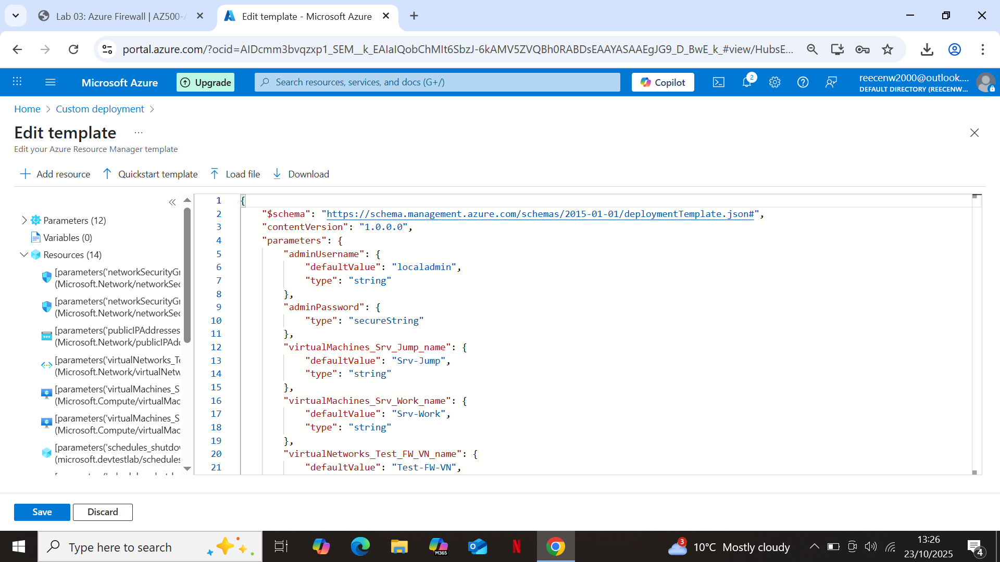

# Lab 03: Azure Firewall

## Overview
This lab focused on deploying and configuring **Azure Firewall** to control and log network traffic between subnets within a virtual network.  
The lab demonstrated how Azure Firewall integrates with **route tables**, **network rules**, and **application rules** to provide centralised network security and traffic filtering.  
All resources were deployed in the **West Europe** region after editing the original ARM template to ensure full regional compatibility.

---

## Step 1: Deploy Resources Using an ARM Template
I began by deploying the lab resources using the provided `template.json` file from the official Microsoft Learning repository.  
Before deployment, I edited the file to change the **region** from *East US* to *West Europe* to avoid regional capacity issues experienced in previous labs.  

The deployment included:
- A virtual network with multiple subnets (including AzureFirewallSubnet)
- Two virtual machines for testing (Test-FW01 and SRV-Work267)
- A route table and associated resources

---

## Step 2: Verify Resource Deployment
After the ARM template deployment completed successfully, I verified that the resource group and all dependent components had been created correctly.

.png)

---

## Step 3: Configure Azure Firewall
Once deployed, I configured the **Azure Firewall (Test-FW01)** instance to filter outbound network traffic and apply rule collections. The rule collections would state that the machine can only access https://www.bing.com

### Application Rule Collection
The application rule collection allowed HTTP and HTTPS traffic to specific domains from internal subnets.

.png)

### Network Rule Collection
The network rule collection controlled outbound network access based on IP address and port configuration.

.png)

.png)

---

## Step 4: Configure Route Tables
I then configured the **Firewall-Route** and **FW-DG** route tables to ensure traffic was correctly routed through the Azure Firewall for inspection.

- The **Firewall-Route** table included one subnet association to direct subnet traffic through the firewall.
- The **FW-DG** route defined next-hop rules pointing to the Azure Firewall private IP.

.png)

.png)

---

## Step 5: Validate DNS and Network Settings
On the `srv-work267` virtual machine, I confirmed the **DNS server** configuration was updated to point to the firewall’s private IP address.  
This ensured that name resolution passed through the firewall for logging and inspection.

.png)

---

## Step 6: Remote Testing and Validation
Two VMs were deployed as part of the environment to test connectivity:
- **Test-FW01** (Firewall host)
- **SRV-Work267** (internal workstation)

I connected to both using **Remote Desktop Protocol (RDP)** to validate outbound access and rule enforcement.  
Although screenshots from the RDP sessions were attempted, Azure’s remote desktop security policies prevented them from saving.
I first connected to Srv-Jump and ran the  mstsc /v:Srv-Work command to connect to Srv-Work.
From Srv-Work, I navigated to *IE Enhanced Security Configuration* through the **Server Manager** and set both options to *Off*.
I attempted to connect to https://www.bing.com/ and was successful. 
I then attempted to connect to https://www.microsoft.com/ and was unsuccessful, showing the FireWall was connected and operating successfully.
Testing confirmed that network and application rules worked as expected, allowing permitted traffic while blocking disallowed outbound requests.

---

## Step 7: Clean Up Resources
After completing all verification steps, I deleted the entire resource group using PowerShell to clean up the environment and prevent ongoing resource costs.
I used the following command: Remove-AzResourceGroup -Name AZ500-Lab03 -Force

.png)

---

## Summary 
This lab demonstrated how **Azure Firewall** can be used as a stateful, centralised network security solution to inspect and filter outbound and inbound traffic in Azure.
By integrating the firewall with **route tables**, **DNS configuration**, and **application/network rule collections**, I was able to enforce consistent security policies across subnets.
Deploying through an ARM template provided a repeatable and automated way to provision secure network environments in Azure, facilitating any potential future deployments.

